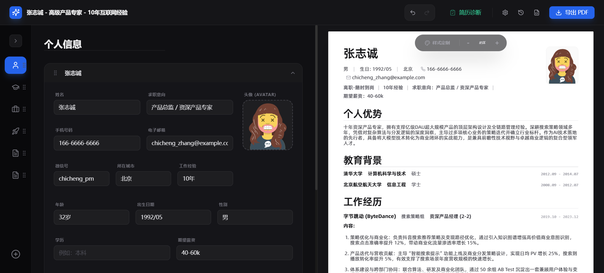
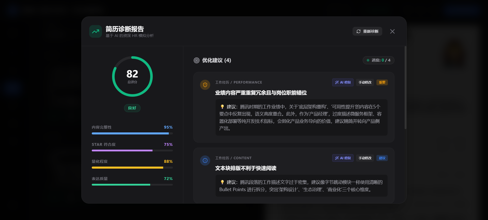

<div align="center">
  <h1>🚀 AI Resume Architect</h1>

  <p>
    <b>隐私优先的 AI 简历构建神器｜集润色、扩展、诊断、导出于一体</b>
    <br />
    <a href="https://ara.yingluowu.com/"><strong>🌐 立即访问：ara.yingluowu.com</strong></a>
  </p>

  <p>
    <a href="https://github.com/xiaohu31/ai-resume-architect/stargazers"></a>
    <a href="https://github.com/xiaohu31/ai-resume-architect/network/members"></a>
    <a href="https://github.com/xiaohu31/ai-resume-architect/blob/main/LICENSE"></a>
  </p>

  <p>
    <b>AI Resume Architect</b> 是一款集成了 <b>Gemini 2.0 / GPT-4o</b> 智能驱动的现代化简历构建平台。通过 <b>STAR 法则</b> 深度诊断与字段级 AI 助手，助您快速产出极具专业竞争力的简历。项目坚持 <b>隐私优先</b>，所有数据均存储在本地浏览器，零后端依赖，支持本地离线运行。
  </p>
  <p>
    <a href="https://ara.yingluowu.com/">立即体验 →</a>
  </p>
</div>

---

## 🌟 项目简介 (Introduction)

**AI Resume Architect** 是一款基于 React 19 和 Vite 6 构建的高性能 Web 应用。它兼具了编辑器的灵活性与 AI 的深度优化能力，旨在解决“简历内容空洞”、“排版困难”和“隐私泄露”三大痛点。

> **GitHub Search Optimized Keywords:** AI Resume Builder, Resume Generator, Gemini Resume Advisor, Smart Resume Editor, Privacy-First Resume, React PDF Export, STAR Method Resume, Career Assistant.

---

## 📸 功能预览 (Feature Preview)

| 主编辑界面 | AI 简历诊断报告 |
| :---: | :---: |
|  |  |

---

## ✨ 核心特性

- 🤖 **AI 深度驱动**
  - **智能润色**：一键提升语义表达，使用更专业的行业术语。
  - **内容扩展**：挖掘经历细节点，自动对齐 STAR 法则（情境、任务、行动、结果）。
  - **选中即触发**：支持在编辑器中选中任意文本，即可弹出 **浮动 AI 工具栏**，快速进行润色、扩展，交互更加自然高效。
  - **智能诊断**：从完整性、量化程度、表达质量等维度对简历进行打分并提供修改建议。
- 🛡️ **极致隐私保护**
  - **全本地化存储**：利用 IndexedDB 技术，数据持久化于浏览器中，不上传至任何中心化服务器。
  - **无后端依赖**：真正零后端架构，保护个人信息不外泄。
- 📦 **模块化编辑器**
  - **自由拖拽**：基于 `@dnd-kit` 实现模块间无缝拖拽排序。
  - **灵活定义**：支持教育背景、工作经历、项目经验、专业技能等预置模块及无限自定义模块。
- 🎨 **专业级视觉与导出**
  - **实时预览**：A4 纸比例精准渲染，所见即所得。
  - **高级样式定制**：动态调整字体大小、行高、页边距、主题间距等。
  - **高清 PDF 导出**：支持通过浏览器打印引擎一键生成标准 PDF。
- 📸 **版本管理系统**
  - **快照存档**：支持为不同公司或岗位创建专属简历快照（如：阿里版、腾讯版、V1.0）。
  - **撤销/重做**：基于 Zundo 的完整操作历史记录。

---

## 🛠️ 技术栈

| 类别 | 技术 |
| :--- | :--- |
| **框架** | React 19 + Vite 6 |
| **状态管理** | Zustand (Persistent) + Zundo (Undo/Redo) |
| **样式** | Tailwind CSS (Dark Mode Support) |
| **存储** | IndexedDB (Powered by Dexie.js) |
| **AI 模型** | Gemini 2.0 Flash / OpenAI GPT-4o / 自定义 API |
| **拖拽** | @dnd-kit |
| **图标** | Lucide React |

---

## 🚀 快速开始

### 前置要求
- Node.js (v18+)
- npm 或 pnpm

### 本地部署

1. **克隆仓库**
   ```bash
   git clone https://github.com/xiaohu31/ai-resume-architect.git
   cd ai-resume-architect
   ```

2. **安装依赖**
   ```bash
   npm install
   ```

3. **配置环境变量**
   在根目录创建 `.env.local` 文件并添加：
   ```env
   VITE_GEMINI_API_KEY=你的GeminiKey
   # 或在应用内的“设置”界面直接配置
   ```

4. **启动开发服务器**
   ```bash
   npm run dev
   ```

5. **浏览器访问**
   打开 `http://localhost:3000` 开始制作。

### Vercel 部署

本项目支持在 Vercel 上一键部署：

[](https://vercel.com/new/clone?repository-url=https%3A%2F%2Fgithub.com%2Fxiaohu31%2Fai-resume-architect&env=VITE_GEMINI_API_KEY)

**部署步骤：**
1. 点击上方的“Deploy with Vercel”按钮。
2. 按照提示连接 GitHub 仓库。
3. 在环境变量中添加 `VITE_GEMINI_API_KEY`（可选，也可以在应用内设置）。
4. 部署完成后即可访问你的专属简历工具。

---

## 💡 使用建议

1. **配置 AI**：在顶部导航栏点击 **⚙️ 设置**，选择你的 AI 提供商（Gemini 或 OpenAI）。Gemini 响应速度快且目前提供免费层级。
2. **使用 AI 助手**：在编辑具体的描述文本时，点击下方的“润色”或“扩展”按钮，AI 会根据上下文给出优化后的对比建议。
3. **定期诊断**：完成草稿后，点击 **📋 诊断**，根据反馈优化内容的量化数据。
4. **版本存档**：投递不同岗位前，建议点击 **📂 版本管理** 保存快照。

---

## 🔒 隐私承诺

我们郑重承诺：您的所有简历数据（包括姓名、电话、教育背景等）仅存储在您本地浏览器的 **IndexedDB** 数据库中。除非您主动点击 AI 优化功能（此时会向 AI 服务商发送当前描述文本），否则任何数据都不会离开您的设备。

---

## 📄 开源协议

本项目基于 [MIT](LICENSE) 协议开源。

---

<div align="center">
  制作不易，如果这个项目对你有帮助，欢迎点个 ⭐️ Star！
</div>
