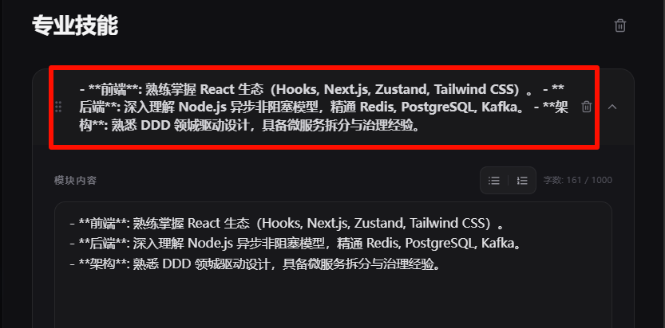

- [x] 1.拖拽图标常驻化，让用户能够明确功能，拒绝现在的鼠标悬浮出现
- [x] 2、专业技能的模块名和内容一致，这不合理，需要改成“专业技能”即可
- [x] 3、模块名要支持能够单独修改，同步到预览的内容里 
- [x] 4、简历诊断分析出的问题，我希望用户能够在该诊断页面直接修改，修改同步到原有内容和预览内容里
- [x] 拖拽图标从超出边界，视觉效果不好
- [x] 模块名输入框 Hover 边框效果不是常驻的，也是需要鼠标移动上去才显示，用户感知不到能修改